# Zadoo — Full Architecture

Zadoo is a **Windows remote-screen / remote-control product** with a usage-metered SaaS billing backend. A host PC runs a native **Settings app + streaming runtime**; viewers open a **public Cloudflare-tunnel link** in a browser to watch the host screen, control it, hear its audio, use a terminal/webcam, and **buy session credits** via Razorpay. Billing, accounts, device linking and entitlements live in a separate **Next.js cloud app** on Vercel + Postgres.

This document describes the **entire** design: topology, components, data model, identity/auth, every request path, the streaming and audio pipelines, the payment flow, configuration, build/deploy, and known limitations.

---

## 0. Glossary

| Term | Meaning |
|---|---|
| **Runtime** | The Python streaming server (`zadoo_vnc`), packaged as `Zadoo.exe`. Binds `localhost:6173`. |
| **Settings app** | The native Tkinter window (`settings_window.py`) that signs in, starts/stops the runtime, and shows the public link. Same `Zadoo.exe`, launched with `--settings`. |
| **Cloud** | The Next.js app (`web/`) at `https://zadoo-web.vercel.app`. Handles accounts, devices, billing. |
| **Public link** | A `*.trycloudflare.com` URL created by `cloudflared` that tunnels to `localhost:6173`. |
| **Viewer** | A browser opening the public link to watch/control the host. |
| **Device token** | An opaque bearer token minted by the cloud when a device is signed in; stored DPAPI-encrypted on the host; used for all `agent/*` cloud calls. |
| **Access code** | A short host-set password viewers type to authenticate to the *local* runtime (separate from the cloud account). |
| **Entitlement / wallet** | Cloud-side metering: included plan minutes + pay-as-you-go wallet minutes. |

---

## 1. Two repositories / two deployables

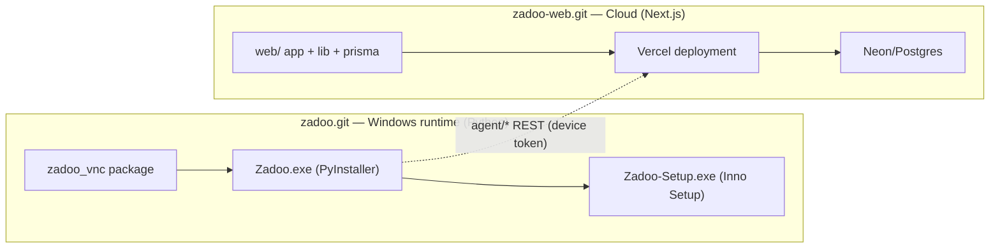

* **`zadoo.git`** builds the host installer. Source: `zadoo_vnc/`, `zadoo_vnc_single.py` (entry), `scripts/build_windows.ps1`, `installer/zadoo.iss`.
* **`zadoo-web.git`** is `web/`: Next.js 15 App Router, NextAuth v5, Prisma, Razorpay. Auto-deploys to Vercel on push.

---

## 2. Top-level topology

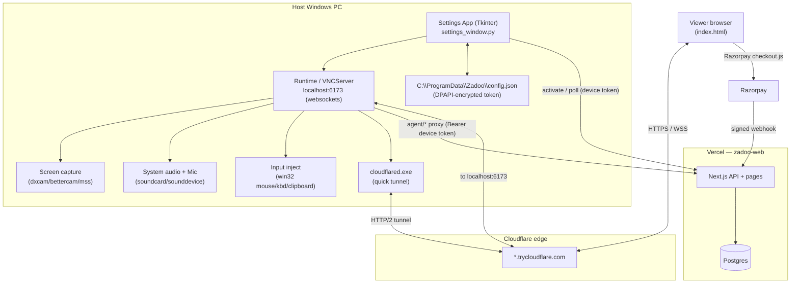

Key point: **viewers never talk to the cloud directly.** The payment panel calls the **local** runtime (`/api/local/*`), which **proxies** to the cloud using the host's device token. The cloud talks to Razorpay; Razorpay's checkout widget runs in the viewer's browser.

---

## 3. Identity & auth — three independent layers

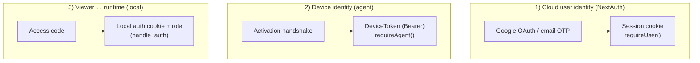

1. **User identity** — `web/app/api/auth/[...nextauth]` (Google + email OTP). `requireUser()` (`web/lib/auth.ts`) gates dashboard/device/checkout routes. NextAuth tables: `User`, `Account`, `Session`, `VerificationToken`.
2. **Device identity** — the host proves itself with a **DeviceToken** bearer (`requireAgent()` in `web/lib/agent.ts`): `tokenHash = hmacToken(token)` looked up in `DeviceToken`; rejected if revoked or `device.status==REVOKED`. Used for all `/api/agent/*` calls.
3. **Viewer → runtime** — the local server issues its own **role + cookie** when a viewer POSTs the host's **access code** to `/api/auth` (`handle_auth`). Roles map to a **permission matrix** (which features are allowed). This is entirely local; the cloud is not involved.

---

## 4. Runtime component architecture (`zadoo_vnc`)

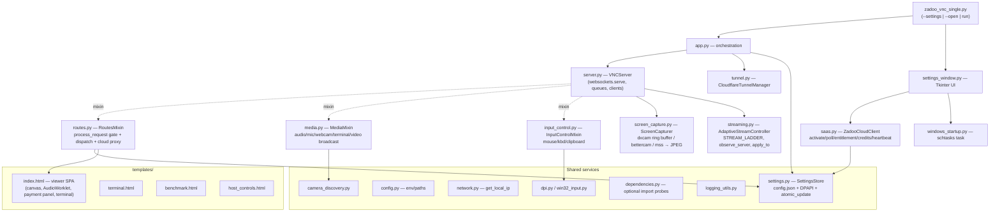

**Module responsibilities**

| Module | Role |
|---|---|
| `zadoo_vnc_single.py` | Entry shim. Dispatches `--settings` / `--open` / default run. |
| `app.py` | Startup orchestration: free port 6173, decide tunnel (signed-in + not revoked + not disabled), build `VNCServer`, `ScreenCapturer`, `CloudflareTunnelManager`, run `asyncio` server. |
| `server.py` | `VNCServer`: `websockets.serve`, holds `current_fps/current_quality`, the `AdaptiveStreamController`, client sets (`video/audio/mic/input/cursor`), realtime queues (`audio_queue`, `mic_queue`), `frame_ready_event`. Composed of the three mixins. |
| `routes.py` | `RoutesMixin`: `process_request` security gate, full HTTP/WS route dispatch, `/api/local/*` → cloud **proxy** (`_proxy_cloud_get/post`), local auth (`handle_auth`, access codes), feature/permission map. |
| `media.py` | `MediaMixin`: system-audio loopback + mic capture, `/audio` `/mic` send loops, webcam (`/webcam`), terminal PTY (`/ssh`, `winpty`), **video broadcast loop**, `_clarify_mono_audio` AGC. |
| `input_control.py` | `InputControlMixin`: `/input` WS → mouse/keyboard/clipboard via win32, cursor broadcast. |
| `screen_capture.py` | `ScreenCapturer`: backend select (dxcam ring buffer / bettercam / mss / fast-ctypes), scale/grayscale, JPEG encode (`imagecodecs`/opencv/Pillow). |
| `streaming.py` | Adaptive bitrate controller: `STREAM_LADDER`, `observe_server` (latency/backlog/bitrate heuristics), `apply_to` (push fps/quality/scale to capturer). |
| `tunnel.py` | `CloudflareTunnelManager`: spawn `cloudflared tunnel`, parse public URL, signature-verify (cached), optional Resend email. |
| `saas.py` | `ZadooCloudClient`: HTTP client to the cloud `agent/*` API (activation, poll, entitlement, credits, profile, heartbeat, go-offline). |
| `settings.py` | `SettingsStore`: `C:\ProgramData\Zadoo\config.json`, DPAPI encrypt for secrets, `atomic_update`, normalized defaults, access-code hashing. |
| `settings_window.py` | `ZadooSettingsWindow`: tabs (Access/Account/Permissions/Alerts/Runtime), autosave, sign-in/activation, Start/Stop runtime, public-link display, credits, DPI-aware sizing. |
| `windows_startup.py` | Create/remove the `schtasks` logon task. |
| `dpi.py`, `win32_input.py` | DPI awareness + raw win32 input. |
| `config.py`, `network.py`, `dependencies.py`, `logging_utils.py`, `camera_discovery.py`, `assets.py`, `process_utils.py` | Env/paths, local IP, optional-dependency probes, logging, camera enumeration, asset paths, process helpers. |

---

## 5. Cloud component architecture (`web/`)

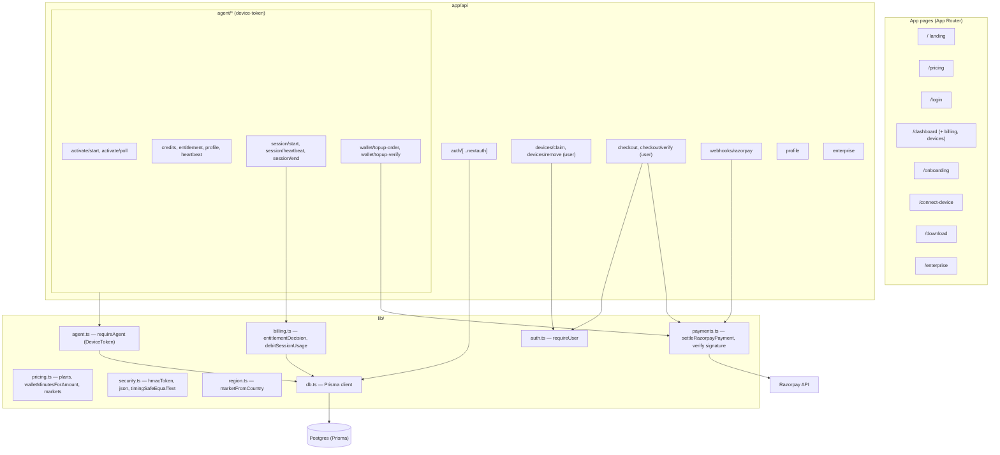

---

## 6. Data model (Prisma / Postgres)

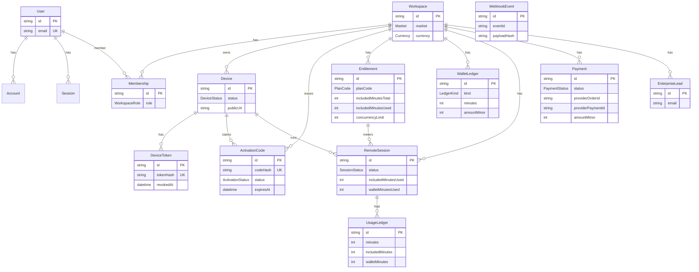

**Enums:** `WorkspaceRole(OWNER/ADMIN/MEMBER)`, `Market(INDIA/GLOBAL)`, `Currency(INR/USD)`, `PaymentProvider(RAZORPAY/MANUAL)`, `PaymentStatus(PENDING/PAID/FAILED/CANCELED/REFUNDED)`, `PlanCode(PAYG/TRIAL_15/PASS_14D/MONTHLY/YEARLY/ENTERPRISE)`, `EntitlementStatus(ACTIVE/EXPIRED/REVOKED/GRACE)`, `DeviceStatus(PENDING/ACTIVE/REVOKED)`, `ActivationStatus(PENDING/CLAIMED/EXPIRED)`, `SessionStatus(ACTIVE/ENDED/BLOCKED)`, `LedgerKind(CREDIT/DEBIT/ADJUSTMENT)`.

Notable constraints: `DeviceToken.tokenHash @unique`, `Payment @@unique([provider, providerPaymentId])`, `WebhookEvent @@unique([provider, eventId])`.

---

## 7. Local route & permission map (runtime)

`routes.py` maps each path to a **feature**; `handle_auth` grants a **role** whose **permission set** decides which features the viewer may use. WebSocket upgrades are auth-checked before the stream handler runs; state-changing HTTP routes in `CSRF_HTTP_FEATURES` require a CSRF token.

| Path | Feature | Notes |
|---|---|---|
| `/`, `/api/auth`, `*.png`, `/api/settings/status` | `public` | always reachable |
| `/video`, `/input`, `/api/public-url`, `/api/stream-stats`, `/benchmark.html` | `view` | viewing/telemetry |
| `/audio` | `system_audio` | system-audio stream |
| `/mic`, `/api/list-mics` | `mic` | host mic stream |
| `/snapshot` | `snapshots` | single frame |
| `/api/set-quality`, `/api/set-fps` | `advanced_video` | CSRF |
| `/api/refresh-tunnel` | `tunnel_refresh` | CSRF |
| `/terminal.html`, `/ssh` | `terminal` | PTY |
| `/webcam`, `/api/list-cameras` | `camera` | webcam |
| `/host-controls`, `/api/alert` | `remote_alerts` | CSRF |
| `/api/local/credits|profile|topup-order|topup-verify` | `billing` | **proxied to cloud** |
| `/api/settings/*`, `/api/runtime/*` | `settings` | admin (Settings window), CSRF; exempt from public-only gate |

### Request gate (every request)

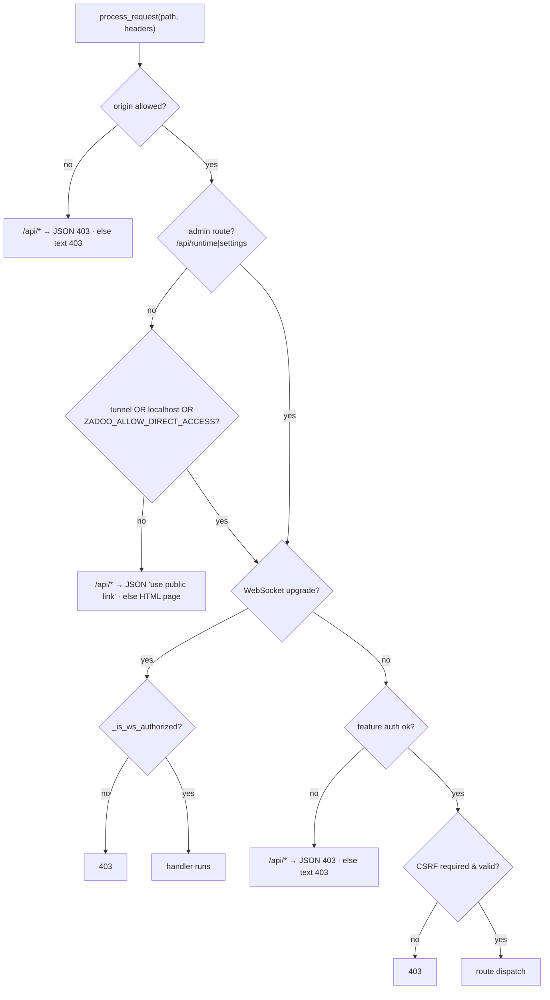

> **Design fix baked in:** every `/api/*` failure returns **JSON** (not the HTML "open via public link" page), so the browser's `resp.json()` never throws `Unexpected token '<'`. Unmatched `/api/*` → JSON 404.

---

## 8. Sequence — device activation & sign-in

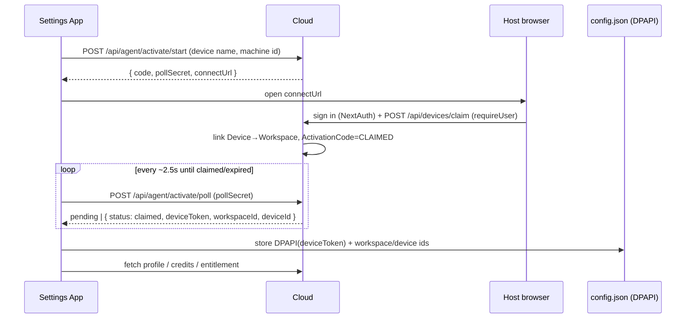

The minted **DeviceToken** is the credential for every subsequent `agent/*` call (heartbeat, credits, top-up proxy, session).

---

## 9. Sequence — start runtime, tunnel, public link

```mermaid
sequenceDiagram
  participant SW as Settings App
  participant Runtime
  participant Cloudflared
  participant Edge as Cloudflare

  SW->>SW: balance>0? signed-in? (else block/prompt)
  SW->>Runtime: launch Zadoo.exe (runtime) [after graceful stop if already running]
  Runtime->>Runtime: bind localhost:6173 (websockets.serve)
  Runtime->>Cloudflared: spawn `cloudflared tunnel --no-autoupdate --protocol http2 --url http://localhost:6173`
  Note over Cloudflared: HTTP/2 avoids QUIC/UDP-7844 backoff on restrictive nets;<br/>signature verified once (cached); stale cleanup in background
  Cloudflared-->>Runtime: parse "*.trycloudflare.com" from stdout
  Runtime-->>SW: public_url (polled into the Settings link)
  SW->>SW: show clickable public link
```

---

## 10. Sequence — viewer connects & authenticates

```mermaid
sequenceDiagram
  participant V as Viewer browser
  participant Edge as Cloudflare
  participant RT as Runtime

  V->>Edge: GET public link
  Edge->>RT: GET / (CF-Connecting-IP present ⇒ tunnel request)
  RT-->>V: index.html (SPA)
  V->>RT: POST /api/auth?code=ACCESS_CODE
  RT->>RT: _match_auth_code → role + permission matrix
  RT-->>V: Set-Cookie auth token + role; CSRF token
  V->>RT: open WS /video /audio /input (auth-checked) per granted features
```

---

## 11. Sequence — video streaming + adaptive control

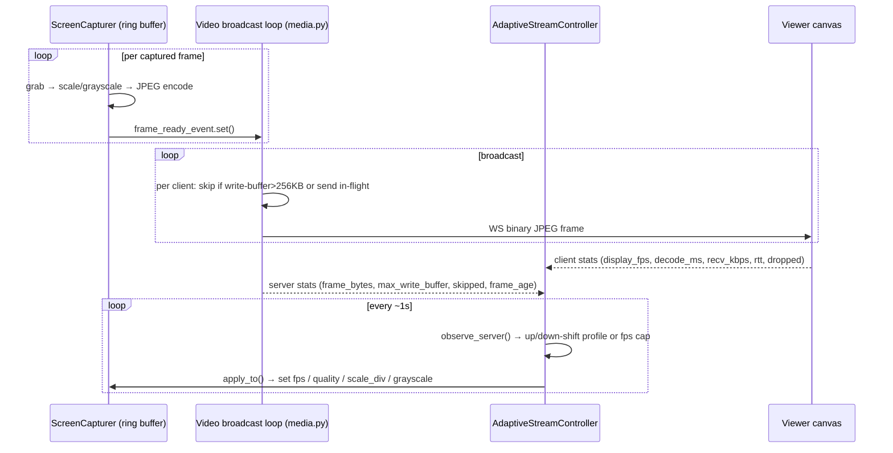

### Adaptive ladder (`STREAM_LADDER`, top = highest bandwidth)

| # | Profile | target FPS | JPEG quality | scale_div |
|---|---|---|---|---|
| 0 | 1080p240 | 240 | 52 | 1 |
| 1 | 720p240 | 240 | 54 | 2 |
| 2 | 1080p120 | 120 | 65 | 1 |
| 3 | 900p120 | 120 | 56 | 1 |
| 4 | 720p120 | 120 | 54 | 2 |
| 5 | 720p60 | 60 | 60 | 2 |
| 6 | **540p60 (default start)** | 60 | 52 | 2 |
| 7 | 540p30 | 30 | 54 | 2 |
| 8 | 540p15 | 15 | 50 | 2 |
| 9 | 360p30 | 30 | 46 | 3 |
| 10 | 360p15 | 15 | 42 | 3 |
| 11 | 360p10 | 10 | 40 | 3 |

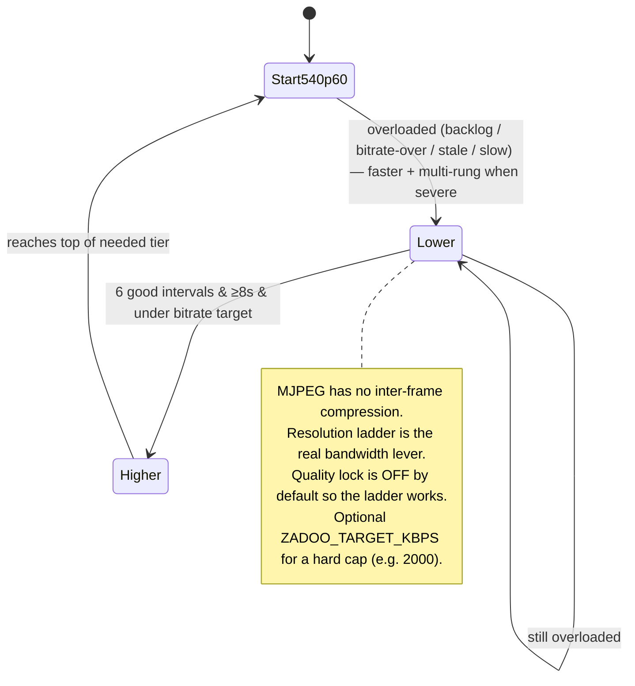

* The default boots **unlocked** (`_quality_locked_by_user=False`) so the **resolution ladder** is active; the lock turns on only if the viewer manually sets a quality.
* Optional **WebRTC turbo path** (FFmpeg → MediaMTX → H.264) exists conceptually but is **not wired in this build** (`webrtc_configured=False`), so the live path is **MJPEG-over-WebSocket**.

---

## 12. Sequence — audio (system + mic) pipeline

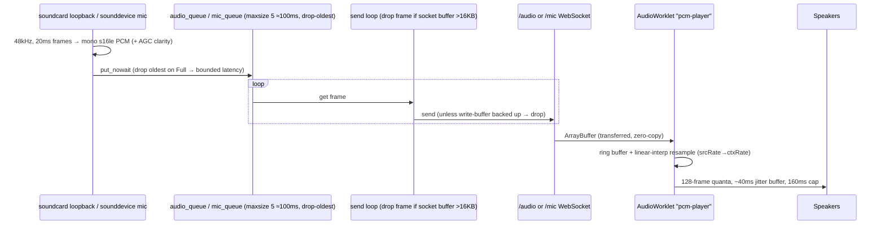

**Robustness properties**
* PCM is **uncompressed 48 kHz mono s16le (~768 kbps)** over WS, played by an **AudioWorklet** (dedicated audio thread, not the main thread → glitch-free).
* The worklet **resamples** to the device AudioContext rate (fixes pitch distortion at 44.1 kHz devices) and keeps a **~40 ms adaptive jitter buffer** (primes before play, caps at ~160 ms, re-primes on underrun).
* Server-side latency is bounded by **small realtime queues (~100 ms, drop-oldest)** and a **socket-buffer drop** (>16 KB) so voice cannot accumulate seconds of lag.

---

## 13. Sequence — input control

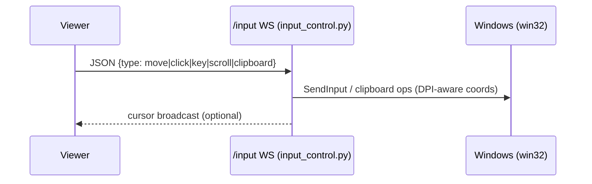

---

## 14. Sequence — payment / top-up (full)

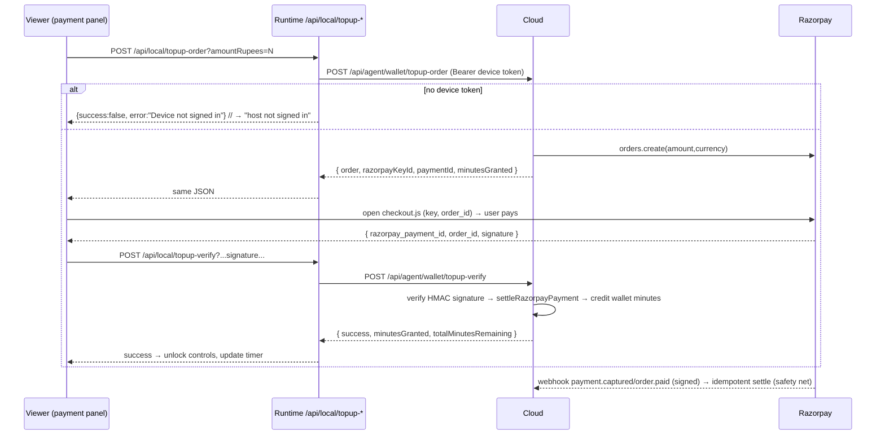

The client reads every response with a **guarded JSON parser**: non-JSON (gate/tunnel/CDN HTML) is mapped to a clear actionable message instead of `Unexpected token '<'`, and the "open via public link" hint is shown **only** for raw-IP/LAN access — never on the cloud link.

---

## 15. Sequence — session metering, grace, lock

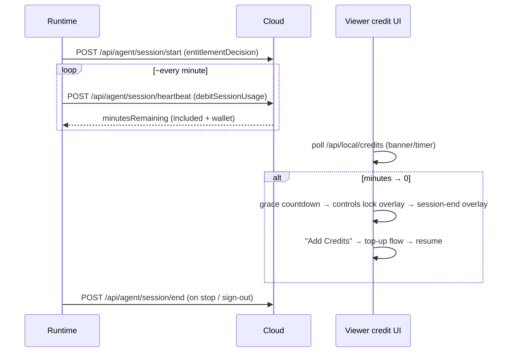

---

## 16. Settings / configuration storage

* File: **`C:\ProgramData\Zadoo\config.json`** managed by `SettingsStore` (`settings.py`).
* Secrets (`device_token`, `resend_api_key`) are **DPAPI-encrypted** (`dpapi:` prefix); if pywin32/DPAPI is unavailable it **degrades gracefully** to obfuscated `plain:` storage (so settings still save) rather than crashing.
* Writes go through `atomic_update` (lock-held read-modify-write) for the concurrent UI/heartbeat paths.
* Key fields: `access_code(_plain)`, `email_to`, `device_name`, `autostart_enabled`, `show_settings_in_taskbar`, `permissions{}`, `alerts{}`, `device_token`, `workspace_id`, `device_id`, `cloud_api_base`, `public_url`, `entitlement_cache`, `credits_cache`, `session_blocked`.

---

## 17. Tunnel internals (`tunnel.py`)

* Command: `cloudflared tunnel --no-autoupdate [--protocol http2] --url http://localhost:6173`.
* **`--protocol http2`** by default avoids cloudflared's QUIC-over-UDP-7844 handshake + exponential backoff on UDP-restricted networks (the main cause of slow public-URL generation). Override via `ZADOO_CLOUDFLARED_PROTOCOL`.
* **Signature verification is cached** per `(path, mtime)` so restarts don't re-run a slow PowerShell `Get-AuthenticodeSignature` each time.
* **Stale-process cleanup runs in the background** (excluding the just-started PID) so it never blocks URL generation.
* Optional **Resend** email of the public link when configured.

---

## 18. Build & deployment

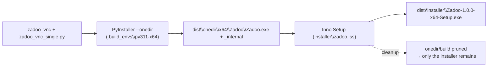

* `scripts/build_windows.ps1 -Arch x64 -NoSelfSign -SkipPortable`: creates the py3.11 venv, installs `requirements.txt` + `build_requirements.txt`, runs PyInstaller (onedir), then Inno Setup, then **deletes the loose one-folder app** so only `Zadoo-1.0.0-x64-Setup.exe` remains (`-KeepOneDir` opts out).
* The installer installs to `Program Files\Zadoo`, registers a `schtasks` logon task, creates **"Zadoo Settings" / "Open Zadoo"** shortcuts, and opens Settings on Finish. Uninstall removes the task and offers to delete `ProgramData\Zadoo`.
* The runtime needs **Python 3.11 (x64)** at build time and bundles `cloudflared.exe`; FFmpeg/MediaMTX are optional (turbo path).
* The **cloud** (`web/`) auto-deploys to **Vercel** from `zadoo-web.git`; `next build` fails on TS errors (no `ignoreBuildErrors`).

---

## 19. Environment variables (selected)

| Var | Where | Purpose |
|---|---|---|
| `ZADOO_CLOUD_API_BASE` | runtime | Cloud base (default `https://zadoo-web.vercel.app`). |
| `ZADOO_ACCESS_CODE` / `CODE_*` | runtime | Local access code(s). |
| `ZADOO_DISABLE_TUNNEL` | runtime | Local-only (no public link). |
| `ZADOO_ALLOW_DIRECT_ACCESS` | runtime | Allow non-tunnel LAN access. |
| `ZADOO_CLOUDFLARED_PROTOCOL` | runtime | `http2`(default)/`quic`/`auto`. |
| `ZADOO_STREAM_START_PROFILE` | runtime | Start ladder rung (default `540p60`). |
| `ZADOO_TARGET_KBPS` | runtime | Hard egress cap (0=off; e.g. `2000` for 2 Mbps). |
| `ZADOO_TURBO_*`, `ZADOO_FFMPEG_PATH`, `ZADOO_MEDIAMTX_PATH` | runtime | Optional WebRTC turbo path. |
| `RESEND_API_KEY`, `EMAIL_TO` | runtime | Public-link email. |
| `DATABASE_URL` | cloud | Postgres. |
| `NEXTAUTH_URL`, `AUTH_SECRET`, `NEXTAUTH_SECRET` | cloud | NextAuth. |
| `AGENT_TOKEN_PEPPER` | cloud | Pepper for `hmacToken` (device-token hashing). |
| `GOOGLE_CLIENT_ID/SECRET` | cloud | Google OAuth. |
| `RAZORPAY_KEY_ID/SECRET/WEBHOOK_SECRET` | cloud | Payments. |

---

## 20. Tech stack

* **Runtime:** Python 3.11, `websockets` (asyncio), `dxcam`/`bettercam`/`mss`/`fast-ctypes-screenshots`, `imagecodecs`/`opencv`/`Pillow` (JPEG), `soundcard`/`sounddevice` (audio), `pywin32`/`keyboard`/`pyautogui` (input), `pywinpty` (terminal), `paramiko`, Tkinter (Settings UI), PyInstaller + Inno Setup, `cloudflared`.
* **Cloud:** Next.js 15 (App Router), React 19, NextAuth v5 (Google + email OTP), Prisma + Postgres (Neon), Razorpay, Vercel.
* **Client (in-browser):** vanilla JS SPA (`index.html`), Canvas for video, **AudioWorklet** for audio, Razorpay `checkout.js`, `xterm.js` (terminal).

---

## 21. Known limitations / risks (from the architecture audit)

These are documented for completeness (not all fixed):

* **Billing:** the Razorpay **webhook can't settle top-ups** (top-up orders carry no `zadooPaymentId` note) → a captured payment is lost if the browser closes before `/topup-verify`; payment **verify isn't bound to the stored `providerOrderId`** → a valid cheap-order signature can settle a different expensive PENDING payment (signature-replay); settlement doesn't re-verify the **amount actually paid**; `session/start` and `debitSessionUsage` have **TOCTOU races** under concurrent calls.
* **Access/admin:** the default access code **`ZADOO123`** can grant a full session when a device is signed-in but `setup_complete` is false; the admin/local gate **trusts the `Host` header**, so `ZADOO_ALLOW_DIRECT_ACCESS=1` + a spoofed `Host` can reach `/api/settings/*` and `/api/runtime/*`.
* **Audio:** multiple simultaneous listeners share **one queue** (frames are split between them); system audio takes the **left channel only** (right-panned audio dropped).
* **Misc:** startup blocks up to ~8 s on a synchronous cloud `entitlement()` call; settings UI autosave runs `schtasks` on the Tk thread; some settings writes bypass `atomic_update`.

---

*Generated as a living architecture reference for Zadoo (runtime `zadoo.git` + cloud `zadoo-web.git`).*
